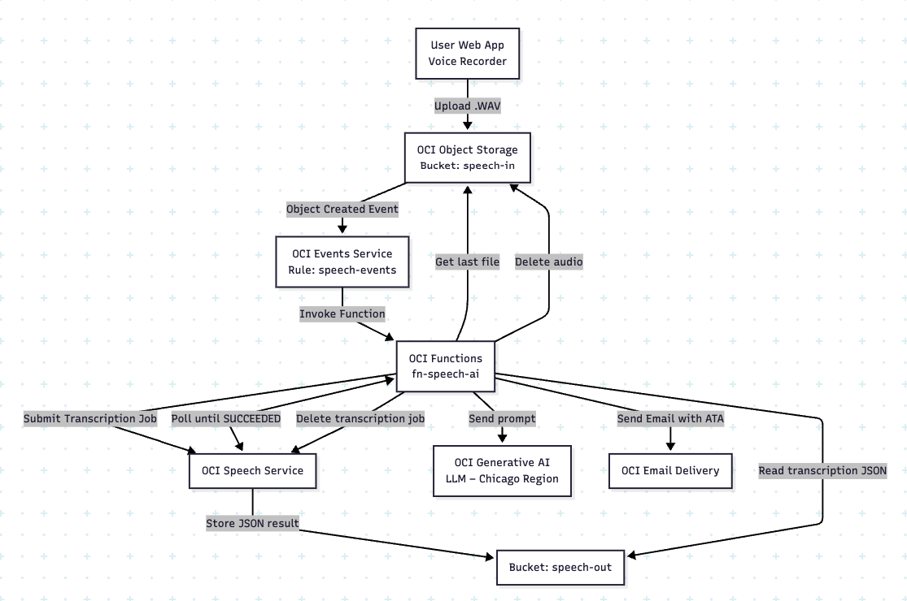

# **AI Audio Processing Pipeline with OCI Speech & Generative AI**

This project implements a complete serverless audio-processing pipeline using **Oracle Cloud Infrastructure (OCI)**.
The architecture captures a `.WAV` audio file from a frontend web application, triggers a serverless workflow through **OCI Events**, processes speech-to-text using **OCI Speech**, generates an HTML meeting minutes document using **OCI Generative AI**, and finally sends the result by email to the original user.

It also automatically cleans all temporary files and Speech jobs.

---

# **📌 Architecture Diagram (ASCII)**

  

```
                           +-----------------------+
                           |  User Web App         |
                           |  (Voice Recorder)     |
                           +-----------+-----------+
                                       |
                                       | Upload .WAV
                                       v
                            +-------------------------+
                            | OCI Object Storage      |
                            | Bucket: speech-in       |
                            +-----------+-------------+
                                        |
                                        | ObjectCreated Event
                                        v
                                +------------------+
                                | OCI Events       |
                                | Rule: speech-events
                                +---------+--------+
                                          |
                                          | Invoke Function
                                          v
                             +--------------------------------+
                             | OCI Functions                  |
                             | Function: fn-speech-ai         |
                             |--------------------------------|
                             | - Find last file in bucket     |
                             | - Extract email from filename  |
                             | - Submit Speech job            |
                             | - Wait for transcription       |
                             | - Generate HTML meeting notes  |
                             |   using OCI Generative AI      |
                             | - Send email with results      |
                             | - Delete audio file            |
                             | - Delete Speech job            |
                             +----------------+---------------+
                                              |
                                              | Write JSON
                                              v
                                +-----------------------------+
                                | OCI Object Storage          |
                                | Bucket: speech-out          |
                                +-----------------------------+
```

---

# **📌 Workflow Summary**

### **1. Audio Capture**

The frontend records audio and uploads a `.WAV` file into the `speech-in` OCI bucket.
The filename follows the pattern:

```
email-oracle-com-<timestamp>.wav
```

### **2. Event Trigger**

An **OCI Event Rule** (`speech-events`) listens for object creation events and invokes the function `fn-speech-ai`.

### **3. Serverless Audio Processing**

Inside the function:

1. Retrieves the most recent `.WAV` file from the bucket
2. Parses the email address from the filename
3. Submits the audio to **OCI Speech**
4. Waits for job completion through a polling loop
5. Reads the resulting transcription JSON from the `speech-out` bucket
6. Sends the transcription to OCI Generative AI to produce a full **Meeting Minutes (HTML)**
7. Emails the result using **OCI Email Delivery**
8. Deletes the input audio
9. Deletes the Speech job

### **4. Fully Automated Cleanup**

After execution:

* Input audio file is removed
* Speech job is deleted
* Output JSON remains for auditing

---


# **📌 Function Code**

The function runs with **Resource Principal authentication**, uses the OCI Python SDK, includes retries for Generative AI calls, and handles end-to-end speech processing.

Below is the exact implementation:

<details>
<summary><strong>📄 func.py</strong></summary>

```python
[COLE O SEU CÓDIGO COMPLETO AQUI — o mesmo que você enviou]
```

</details>

---

# **📌 Function Configuration**

### **func.yaml**

```yaml
schema_version: 20180708
name: fn-speech-ai
version: 0.0.39
runtime: python
build_image: fnproject/python:3.11-dev
run_image: fnproject/python:3.11
entrypoint: /python/bin/fdk /function/func.py handler
memory: 1024
timeout: 300
```

### **Dependencies (requirements.txt)**

```txt
fdk>=0.1.102
oci
pytz
email-validator
python-dateutil
requests
urllib3
jinja2
```

---

# **📌 Filename Format**

The system expects the filename to follow:

```
<user-email-with-dashes>-<timestamp>.wav
```

Example:

```
silvio-cristiano-oracle-com-1732463520000.wav
```

From the filename the system extracts:

* Email
* Username
* Timestamp (converted to UTC)

---

# **📌 How the Generative AI Prompt Works**

The function:

1. Reads the transcription
2. Injects it into an HTML meeting-minutes template
3. Sends the HTML text as a prompt to OCI GenAI
4. Returns a complete formatted “Ata de Reunião”

Retries are included:

```python
while tentativa <= max_tentativas:
    try:
        response = client.chat(chat_detail)
        break
    except Exception as e:
        time.sleep(2 * tentativa)
        tentativa += 1
```

---

# **📌 Email Delivery**

Uses:

* TLS (Port 587)
* OCI Email Delivery SMTP endpoint
* HTML email body

---

# **📌 Buckets Used**

| Purpose     | Bucket Name  |
| ----------- | ------------ |
| Input audio | `speech-in`  |
| Output JSON | `speech-out` |

---

# **📌 OCI Resources Used**

| Service                 | Purpose                         |
| ----------------------- | ------------------------------- |
| Object Storage          | Stores audio and transcriptions |
| OCI Events              | Detects new audio uploads       |
| OCI Functions           | Serverless processing           |
| OCI Speech              | Speech-to-text                  |
| OCI Generative AI       | Meeting minutes generation      |
| OCI Email Delivery      | Sends final ATA                 |
| Resource Principal Auth | Secure function execution       |

---

# **📌 Environment Requirements**

* OCI tenancy with Email Delivery approved domain
* Policies allowing Function → Object Storage → Speech → GenAI → Email
* Python 3.11 function environment
* Configured Function application

---

# **📌 End of Pipeline Output**

Each execution returns:

```json
{
  "status": "OK",
  "file": "<audio-file>",
  "email": "<user-email>",
  "transcription_length": 1234
}
```

---

# **📌 Future Enhancements**

* Add Dead Letter Queue with OCI Queue
* Add monitoring with OCI Logging & Alarms
* Generate PDF attachment for meeting minutes
* Multi-language speech support

